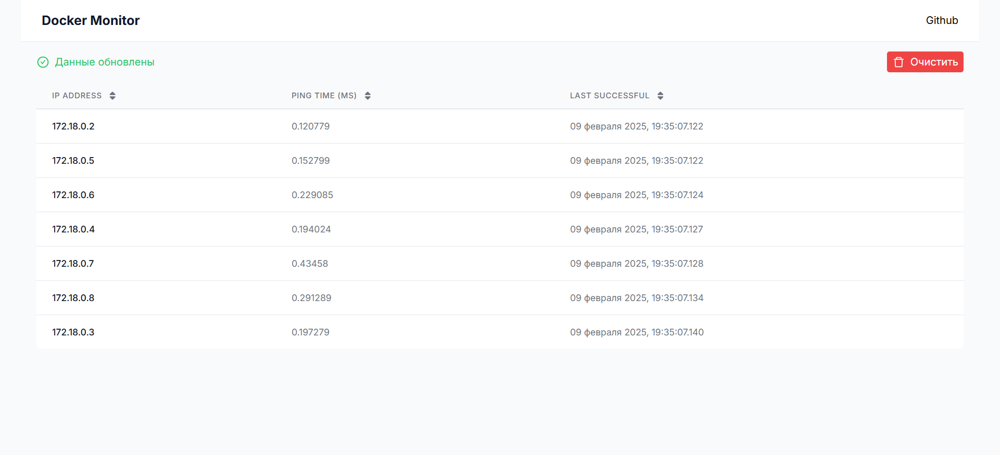

<p align="center">
    <h1 align="center">Docker Monitor</h1>
</p>

> [!NOTE]  
> Вы можете увидеть работу программы на моем сайте [docker-monitor.vingp.dev](https://docker-monitor.vingp.dev/)
>
> Благодоря `netns` программа смогла спарсить и пингануть абсолютно все контейнеры в системе (Docker Compose
> приложения, Docker Swarm сервисы и просто запущенные контейнеры).

## Запуск

> [!WARNING]
> Windows WSL `netns` не поддерживается в полной мере. Чтобы `pinger` мог обращаться к контейнерам в другой сети,
> подключите либо `pinger` к сети контейнера, либо контейнер к сети `pinger`.
>
> Для тестирования полной функциональности в Windows можно
> использовать [Vagrant](https://developer.hashicorp.com/vagrant/docs/installation) (см. [Запуск с Vagrant](#запуск-с-vagrant)).

Для запуска выполните команду:

```shell
docker-compose up --build -d
```

После этого на порту `80` будет доступен фронтенд приложения:

- **Frontend**: [http://localhost](http://localhost)
- **API**: [http://localhost/api](http://localhost/api/docs/index.html)
- **Kafka UI**: [http://localhost:9080](http://localhost:9080)

## Описание сервисов

### Backend

Обеспечивает RESTful API для получения данных из базы и добавления новых записей.

- **Swagger**: [http://localhost/api/docs/index.html](http://localhost/api/docs/index.html)

##### Endpoints

- **`GET /api/container_status`** – получение статусов контейнеров
- **`POST /api/container_status`** – добавление статусов контейнеров
- **`DELETE /api/container_status`** – удаление статусов контейнеров

### Pinger

С заданным интервалом проверяет доступность всех контейнеров в `Docker`. Использует `netns` (`nsenter`), а при неудаче –
обычный `ping`.

Отправляет статусы контейнеров через RESTful API или Kafka.

#### Конфигурирование

Настраивается через переменные окружения:

- **`PING_INTERVAL`** – интервал пинга (в секундах). По умолчанию `10`.

  ```yaml
    pinger:
      environment:
        - PING_INTERVAL=5
  ```

- **`ALL_CONTAINERS`** – если `true`, пингуются все контейнеры, игнорируя остальные параметры. По умолчанию `true`.

  ```yaml
    pinger:
      environment:
        - ALL_CONTAINERS=true
  ```

- **`NETWORKS`** – список сетей (через запятую), контейнеры которых будут пинговаться.

  ```yaml
    pinger:
      environment:
        - NETWORKS=docker_monitor_default,other_network
  ```

- **`COMPOSE_PROJECTS`** – список `docker-compose` проектов (через запятую), контейнеры которых будут пинговаться.

  ```yaml
    pinger:
      environment:
        - COMPOSE_PROJECTS=docker_monitor,other_project
  ```

- **`LABELS`** – если `true`, пингуются контейнеры с меткой `pinger=true`.

  ```yaml
    pinger:
      environment:
        - LABELS=true

    nginx:
      labels:
        - "pinger=true"
  ```

### Frontend

Использует `React (Next.js)`, получает данные через API Backend и отображает их в виде таблицы:

- **Колонки**: IP-адрес, время пинга, дата последней успешной попытки.
- **Функционал**:
    - Кнопка `Очистить` для удаления данных из базы.
    - Сортировка по возрастанию/убыванию для каждой колонки.

<p align="center">
    
</p>

## Запуск с Vagrant

1. Установите [Vagrant](https://developer.hashicorp.com/vagrant/docs/installation)
   и [VirtualBox](https://www.virtualbox.org/wiki/Downloads).
2. Выполните команду:

```shell
vagrant up
```

3. Перейти по [http://localhost:8080](http://localhost:8080)
